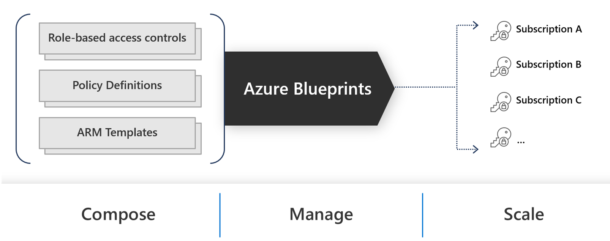

# New Zealand ISM Restricted Azure Blueprint
![banner]

 

## Overview
One of the challenges that government agencies have in their transition from a traditional on premises style data center to a public cloud data center is ensuring that compliance to specific security and regulatory standards is maintained.  In an on premises world the patterns for compliance are well established, and have cadences that can be controlled through defined change and assessment process.  These processes also have timelines that can wait for capability or people to be available, and wrap around technology that has a long runway for change because the agency or their service provider controls the pace of change.  In the public cloud world the pace of change is a lot faster and does not wait for any single customer to be ready, so the process for assessing compliance, and ensuring services are built in a compliant way needs to move just as quickly.

In New Zealand, our government agency responsible for establishing the guidelines is the [GCSB] (Government Communications Security Bureau) and they have established a standard that agencies must adhere to depending on the classification level of the information being stored in the platform.  They have recognized that as the government heads to a more [Digital][NZGovDigital] strategy, the standards, compliance and methods must move apace to ensure that the government can move faster while maintaining security standards.  Alongside this, the complexity and breadth of security threats is outside the capability of many agencies to respond to individually, creating a risk for all of government.

> [Digital][NZGovDigital] is about more than new technologies and improving IT systems. It also means doing things differently using new mindsets, skills, data and technologies to overcome barriers and better meet New Zealand’s needs.

Microsoft has worked with many customers to produce artifacts that enable them to work safely in public cloud environments.  These include documented processes for establishing good practice for [development][AppArch], [landing zone][LZ] design patterns, and frameworks for [Cloud Adoption][CAF].  We have also worked with government to help establish patterns to assess compliance for Azure environments, and the published those to be consumable via the Azure Portal.  Those objects are our [Azure Blueprints][AzureBP], [Azure Policies][AzurePolicy] and [Azure Policy Initiatives][AzurePolicyInit].

We also published a set of tenets to improve the quality of a workload once it has been established in Azure called the [Microsoft Azure Well-Architected Framework][WAF].  The framework consists of five pillars of architecture excellence: Cost Optimization, Operational Excellence, Performance Efficiency, Reliability, and Security.

An area that both Government and Microsoft recognised that could assist New Zealand agencies and companies in cloud adoption was a translation of the NZ ISM Restricted into a set of policies that could allow the implementor a method of measuring their environment against the standard defined by the NZ ISM.  To that end, Microsoft and the GCSB worked together to establish an Azure Policy Initiative and Azure Blueprint to be published in the Azure gallery.  This allows any agency or New Zealand company to apply the standard to their Azure environment, and assess their level of compliance against a defined NZ Government standard.

## What is an Azure Blueprint?

Just as a blueprint allows an engineer or an architect to sketch a project's design parameters, Azure Blueprints enables cloud architects and central information technology groups to define a repeatable set of Azure resources that implements and adheres to an organization's standards, patterns, and requirements. Azure Blueprints makes it possible for development teams to rapidly build and stand up new environments with trust they're building within organizational compliance with a set of built-in components, such as networking, to speed up development and delivery.

Azure Blueprints can be comprised of some or all of the following objects:
* [Resource Groups][AzureRG]
* [ARM Templates][ARMTemplate]
* [Policy Assignments][AzurePolicy]
* [Role Assignments][AzureRBAC]

This allows an organisation to ensure that all resources confirm to an agreed standard of configuration or ensure that new environments are created in a repeatable and automated fashion, reducing human error and ensuring compliance to a standard.  A good example of this would be an Azure Blueprint that contains all of the required components and configuration to allow resources in a subscription to connect to the core production network, RBAC rules to ensure only the right roles have access to specific components and Azure Policies to enforce specific security or configuration rules.  This means that as a new subscription is added to an agencies Azure environment, it is automatically configured to a known good standard.

 
 

## What is a Policy Initiative?
Azure Policy evaluates resources in Azure by comparing the properties of those resources to business rules. These business rules, described in JSON format, are known as policy definitions. To simplify management, several business rules can be grouped together to form a [policy initiative][AzurePolicyInit]. Once your business rules have been formed, the policy definition or initiative is assigned to any scope of resources that Azure supports, such as management groups, subscriptions, resource groups, or individual resources. The assignment applies to all resources within the Resource Manager scope of that assignment. Subscopes can be excluded, if necessary. For more information, see [Scope in Azure Policy][AzurePolicyScope].

 
 

All Azure Policy data and objects are encrypted at rest. For more information, see [Azure data encryption at rest][AzureDataRest].

## How to deploy the NZ ISM Restricted blueprint and policy initiative

First we need to create the resource in your tenant so we can apply it to management groups and\or subscriptions.

### Create blueprint definition
1. Select All services in the left pane. Search for and select Blueprints.
2. From the Getting started page on the left, select the Create button under Create a blueprint.
3. In the Other Samples field type New Zealand and click on the New Zealand ISM Restricted sample.
4. In the Blueprint Name field type a name for your blueprint - this is the name you will use to identify it within your tenant (e.g. NZISM)
5. Click the ellipsis button next to the Definition Location button and select a location for your blueprint to exist.  This is important in that it can only be applied to management groups and subscriptions down the tree from its location.  By default, click Tenant Root Group and click Select to ensure it can be applied at all levels.
6. Click Next:Artifacts
7. This screen shows the individual artifacts that comprise this blueprint.  At this point, you can add further artifacts in if desired.
8. Select Save Draft when you've finished reviewing the blueprint sample.

This step creates a copy of the NZISM blueprint definition in the selected management group or subscription. The saved blueprint definition is managed like any blueprint created from scratch.

### Publish the NZISM blueprint
1. Select the Blueprint definitions page on the left. 
2. Click on the NZISM blueprint
3. Click Publish blueprint
4. Enter a version number such as 1.0 and click Publish

### Assign the NZISM blueprint
1. Select the Blueprint definitions page on the left of the Azure Blueprints main screen
2. Click on the NZISM blueprint
3. Click Assign Blueprint
4. Select the subscriptions you want this blueprint to be assigned
5. In the Assignment Name field type a unique name for this assignment
6. In the Location field select Australia East
7. 

Select Publish blueprint at the top of the page. In the new pane on the right, provide Version as 1.0 for your copy of the blueprint sample. This property is useful for if you make a modification later. Provide Change notes such as "First version published from the resource groups with RBAC blueprint sample." Then select Publish at the bottom of the page.

This step makes it possible to assign the blueprint to a subscription. Once published, changes can still be made. Additional changes require publishing with a new Version value to track differences between different versions of the same blueprint definition.

Once the Publishing blueprint definition succeeded portal notification appears, move to the next step.

Assign the sample copy
Once the copy of the blueprint sample has been successfully Published, it can be assigned to a subscription within the management group it was saved to. This step is where parameters are provided to make each deployment of the copy of the blueprint sample unique.

Select All services in the left pane. Search for and select Blueprints.

Select the Blueprint definitions page on the left. Use the filters to find the two-rgs-with-role-assignments blueprint definition and then select it.

Select Assign blueprint at the top of the blueprint definition page.

Provide the parameter values for the blueprint assignment: 

## How to measure compliance

## How to remediate

## How to override

## How to keep up to date

## Feedback
An important aspect of this blueprint and the policy initiative is to establish a feedback loop between the government agencies, the policy creators and the technology partners.  Working together as a community will ensure that as our technology evolves, so does the governance and management strategy.  It also means that all participants can leverage the shared learnings from establishment through to consumption.

We welcome feedback on things that can improve the artifact's we have published.  Microsoft will be working with the NZ Government to continue to update the Policy Initiative in future to ensure the Azure gallery items stay in step with the standards published by the NZ government.

To that end, for all feedback or questions on the NZ ISM Restricted Azure Blueprint and the Policy Initiative, please feel free to contact me at bevan.sinclair@microsoft.com, or simply talk to your Microsoft account team who can assist.  For feedback on the NZ ISM Restricted standard itself please send all requests to nzism@gcsb.govt.nz.

## Thanks to
This work has been and continues to be a team effort so thanks to the staff at the New Zealand GCSB and NCSC, the agencies who gave their time to pilot the policies, and the internal Microsoft team.  Together we are all working towards setting a great baseline of security for all of New Zealand in the (long white) Cloud.  Also thanks to the Linked In community who have proffered valuable insights and shared the content (@davidwhitenz at Theta!).

## Reference Links
* [New Zealand ISM][NZISM]
* [Azure Blueprints Documentation][AzureBP]
* [Azure Blueprint Samples][AzureBPSamples]
* [David White @ Theta - Article on implementing the NZISM Policy Initiative][DavidWhite]

<!-- Local -->
[Banner]: images/banner.png
[Blueprint]: images/blueprint.png
[Management]: images/management.png

<!-- External -->
[NZISM]: https://www.nzism.gcsb.govt.nz/ism-document
[AzureBP]: https://docs.microsoft.com/en-us/azure/governance/blueprints/overview
[AzureBPSamples]: https://docs.microsoft.com/en-us/azure/governance/blueprints/samples/
[AzurePolicy]: https://docs.microsoft.com/en-us/azure/governance/policy/overview/
[AzurePolicyInit]: https://docs.microsoft.com/en-us/azure/governance/policy/overview#initiative-definition
[AzurePolicyScope]: https://docs.microsoft.com/en-us/azure/governance/policy/concepts/scope
[ARMTemplate]: https://docs.microsoft.com/en-us/azure/azure-resource-manager/templates/
[AzureRG]: https://docs.microsoft.com/en-us/azure/azure-resource-manager/management/overview#resource-groups
[AzureRBAC]: https://docs.microsoft.com/en-us/azure/role-based-access-control/overview
[GCSB]: https://www.gcsb.govt.nz/
[NZISMPolicy]: https://docs.microsoft.com/en-us/azure/governance/policy/samples/new-zealand-ism
[NZGovCC]: https://docs.microsoft.com/en-us/compliance/regulatory/offering-nz-cc-framework-nz
[NZGovDigital]: https://www.digital.govt.nz/digital-government/strategy/strategy-summary/strategy-for-a-digital-public-service/
[WAF]: https://docs.microsoft.com/en-us/azure/architecture/framework/
[CAF]: https://docs.microsoft.com/en-us/azure/cloud-adoption-framework/
[LZ]: https://docs.microsoft.com/en-us/azure/cloud-adoption-framework/ready/landing-zone/
[AppArch]: https://docs.microsoft.com/en-us/azure/architecture/guide/
[DavidWhite]: https://techcommunity.microsoft.com/t5/azure/azure-policy-new-zealand-information-security-manual-nzism/m-p/2144825
[AzureDataRest]: https://docs.microsoft.com/en-us/azure/security/fundamentals/encryption-atrest