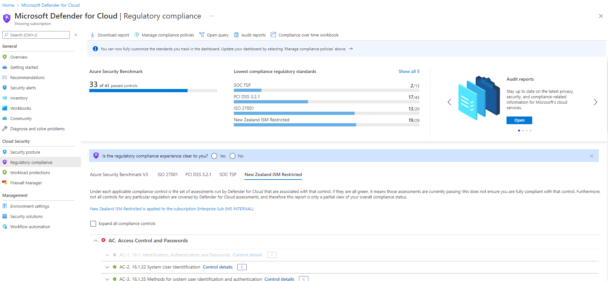

# New Zealand ISM Restricted Azure Policy Initiative Deployment
![banner]

 

## What is an Azure Policy Initiative?
Azure Policy evaluates resources in Azure by comparing the properties of those resources to business rules. These business rules, described in JSON format, are known as policy definitions. To simplify management, several business rules can be grouped together to form a [policy initiative][AzurePolicyInit]. Once your business rules have been formed, the policy definition or initiative is assigned to any scope of resources that Azure supports, such as management groups, subscriptions, resource groups, or individual resources. The assignment applies to all resources within the Resource Manager scope of that assignment. Subscopes can be excluded, if necessary. For more information, see [Scope in Azure Policy][AzurePolicyScope].

Multiple policies can be deployed against the same subscriptions.  Agencies that must adhere to government regulation, industry regulation and their own internal policies can layer them to ensure that they adhere to all.  You can also disable enforcement on some, to ensure that you are reporting on compliance only and reducing the complexity of layers of enforcement.  [Planning policy layering][AzurePolEvaluate] in this way requires some thought and design to ensure there is no policy collision but a simple way to manage it is to use naming conventions on the policy objects to identify which ones you are enforcing and which ones you are not.  Disabling enforcement mode is also a good way of testing the impact of new settings.

If you are also training your engineers to understand DevOps workflows, managing policy via code repository is a good way of starting them on that journey.  You can manage your Policy templates as code in a repo of your choice, and deploy it directly [to Azure using a DevOps pipeline][AzurePolascode].

 
 

All Azure Policy data and objects are encrypted at rest. For more information, see [Azure data encryption at rest][AzureDataRest].

## How to deploy the NZ ISM Restricted Policy Initiative

Deployment of the policy initiative depends on how you manage your regulatory compliance in Azure.  You can deploy it manually through the Azure Policy blade, or via the Regulatory Compliance capability in Microsoft Defender for cloud.  For an automated solution, you can use Azure DevOps to assign a specific version from the gallery.  This is an automated and auditable process that is highly recommended to streamline this process.

When deploying the NZ ISM Policy Initiative manually, you can deploy it from the Azure Policy blade in the Azure Portal.

1. In the Azure portal, click in the search bar at the top and type Policy, and then click on Policy under Services
2. Expand Authoring and click on Definitions
3. In the Search field type New Zealand and the New Zealand ISM policy should be listed
4. Click the ellipsis at the end of the line and select Assign Initiative
5. Set the scope by selecting the Subscription or Resource Group this policy will apply to.
6. Exclude any subscopes if required by clicking on the Exclude subscopes link and selecting specific resource groups or resources to exclude.
7. Click the ellipsis next to the Version field. 
8. If required, update the Assignment Name, perhaps to include the version number of the NZISM you are aligning to.
9. Set Policy Enforcement to Disabled.  
> Note: The Policy Enforcement switch here allows you to disable any Enforcement policies and only return compliance if required.  It is recommended to disable enforcement for all compliance policies as this process is about reporting compliance to a standard, not enforcement.
10. Click Next 
11. In the Parameters screen, set the Minimum RSA Key Size to 2048 and leave all other entries as default.
12. Click Next
13. Leave the Remediation Managed Identity as disabled and click Next
14. Leave the default Non-Compliance messages and click Next.
15. Click Review and Create.  Notice on this last screen the specific settings that require input are listed here in the Parameters section along with your entries.  Its a good way to ensure you have configured the correct parameters if they are required.

## How to measure compliance

Once the policy has deployed it takes some time to review all the resources and assess compliance.  Once complete, you can review this in the core Policy screen

On the overview screen, click on the NZ ISM Policy to open the Initiative Compliance dashboard

You should see an overview of compliance, with the non-compliant controls listed below.  If you click on one of the non-compliant controls it will take you to a detail screen explaining the NZ ISM control that is non-compliant (with a link to read more).  If you click on Policies it will show the Azure Policies that are linked to this control, and which ones are not compliant.  If you click on Resource Compliance this shows the specific resources that are not meeting the required policy.

## How to remediate

Some policies have automated remediation tasks you can kick off from the Policy console.  From the Initiative Compliance dashboard, click on Create Remediation Task at the top of the screen.
In the drop down box this will list the specific policies you can Remediate (e.g. Deploy Dependency agent for Windows virtual machines)
It will also list the Resources this remediation task will apply to, so when you click Remediate it will initiate the task on all of those resources.  In the screenshot below, this is an example of deploying the dependency agent for a non-compliant Windows machine.

## How to override

For some environments or resources, some policies or configurations may not be valid or required.  Examples of this might be where you are achieving compliance through a different method like monitoring VM resources through the use of a 3rd party security system.  If thats the case, you can override the specific control permanently or for a defined term with an explanation.  This ensure the override process is auditable and reportable.

From the Initiative Compliance dashboard, click on Create Exemption Task at the top of the screen
This walks you through a series of screens to configure the category and expiration of the Exemption, and the specific scope and policies that this exemption covers.

## How to keep up to date

As feedback is received from the community, and as new policy settings are developed and the NZ ISM evolves to address new threats, so will the sample template change.  To keep up to date, you can simply redeploy the new version of the Policy Initiative in the same way that you have previously deployed it, and remove the old version.  As discussed earlier, policy deployment and staying current with updates in Azure is a muscle that needs to be built as part of a good Cloud Ops team, so the NZ ISM is a good artefact to use to train that muscle.

![AzurePolicyWorkflow]

Using Azure DevOps to check in the code, version it and deploy it to Azure is an automated and auditable process that is highly recommended to streamline this process.

## Microsoft Defender for Cloud and exporting a report

The NZ ISM Policy Inititiative is now available as a built in compliance report in the Microsoft Defender for Cloud dashboard.

You can view your compliance as a more detailed dashboard, and also export this as a PDF or CSV.

[See here for more information on how this works][DfCRegComp].

<!-- Local -->
[Banner]: images/banner-w.png
[Blueprint]: images/blueprint.png
[Management]: images/management.png
[Dashboard]: images/securitydashboard.png

<!-- External -->
[NZISM]: https://www.nzism.gcsb.govt.nz/ism-document
[AzureBP]: https://docs.microsoft.com/en-us/azure/governance/blueprints/overview
[AzureBPSamples]: https://docs.microsoft.com/en-us/azure/governance/blueprints/samples/
[AzurePolicy]: https://docs.microsoft.com/en-us/azure/governance/policy/overview/
[AzurePolicyInit]: https://docs.microsoft.com/en-us/azure/governance/policy/overview#initiative-definition
[AzurePolicyScope]: https://docs.microsoft.com/en-us/azure/governance/policy/concepts/scope
[ARMTemplate]: https://docs.microsoft.com/en-us/azure/azure-resource-manager/templates/
[AzureRG]: https://docs.microsoft.com/en-us/azure/azure-resource-manager/management/overview#resource-groups
[AzureRBAC]: https://docs.microsoft.com/en-us/azure/role-based-access-control/overview
[GCSB]: https://www.gcsb.govt.nz/
[NZISMPolicy]: https://docs.microsoft.com/en-us/azure/governance/policy/samples/new-zealand-ism
[NZGovCC]: https://docs.microsoft.com/en-us/compliance/regulatory/offering-nz-cc-framework-nz
[NZGovDigital]: https://www.digital.govt.nz/digital-government/strategy/strategy-summary/strategy-for-a-digital-public-service/
[WAF]: https://docs.microsoft.com/en-us/azure/architecture/framework/
[CAF]: https://docs.microsoft.com/en-us/azure/cloud-adoption-framework/
[LZ]: https://docs.microsoft.com/en-us/azure/cloud-adoption-framework/ready/landing-zone/
[AppArch]: https://docs.microsoft.com/en-us/azure/architecture/guide/
[DavidWhite]: https://techcommunity.microsoft.com/t5/azure/azure-policy-new-zealand-information-security-manual-nzism/m-p/2144825
[AzureDataRest]: https://docs.microsoft.com/en-us/azure/security/fundamentals/encryption-atrest
[AzureResLock]: https://docs.microsoft.com/en-us/azure/governance/blueprints/concepts/resource-locking
[AzurePolicyBuiltin]: https://docs.microsoft.com/en-us/azure/governance/policy/samples/built-in-policies
[AzurePolEvaluate]: https://docs.microsoft.com/en-us/azure/governance/policy/concepts/evaluate-impact
[AzurePolascode]: https://docs.microsoft.com/en-us/azure/governance/policy/concepts/policy-as-code
[DfCRegComp]: https://docs.microsoft.com/en-us/azure/defender-for-cloud/regulatory-compliance-dashboard
[AzurePolicyWorkflow]: https://docs.microsoft.com/en-us/azure/governance/policy/media/policy-as-code/policy-as-code-workflow.png
[NZISMDiscussion]: https://github.com/BevanSin/nzismdocs/blob/master/nzismdiscussion.md
[CAF-GOV]: https://docs.microsoft.com/en-us/azure/cloud-adoption-framework/govern/guides/standard/security-baseline-improvement
[isanz]: https://www.isanz.org.nz/#entries
[AzurePolicyVersioning]: https://techcommunity.microsoft.com/t5/azure-governance-and-management/public-preview-announcement-azure-policy-built-in-versioning/ba-p/4186105